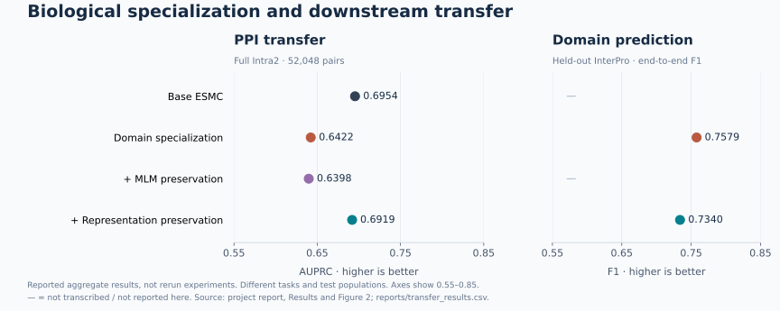

# When biological specialization helps—and hurts—PPI prediction

**Protein representation learning · Transfer learning · Leakage-reduced evaluation**

Research by **Kareem Ayass**, BSc Honours Computer Science and Biology, McGill University. Conducted in the **COMBINE Lab**, supervised by **Prof. Amin Emad**.

**Can a protein language model learn more biology while retaining the representations needed to distinguish interaction partners?** This project investigates that question through PPI-directed LoRA adaptation, InterPro Domain supervision, and preservation of pretrained ESMC representations.

The central finding is a transfer-learning trade-off: **accurate Domain prediction did not produce better PPI predictions.** Direct representation preservation recovered most of the lost PPI performance, while protein-level audits showed why a small accuracy gain from PPI adaptation was not evidence of better partner discrimination.

[Results & interpretation](docs/results.md) · [Methods](docs/methods.md) · [Code guide](docs/code-guide.md) · [Reproduce & run](REPRODUCIBILITY.md)

*Values transcribed from the project report; this figure is regenerated from [the checked-in summary](reports/transfer_results.csv), not from a new training run. All PPI conditions above use the same 52,048-pair Intra2 partition. See [provenance](reports/README.md).*

## The investigation

| Question | Experiment | Finding |
|---|---|---|
| Does direct PPI supervision improve partner discrimination? | ESM-2 + LoRA-r8 inside TUnA; endpoint and same-anchor audits | Accuracy changed from **0.647 to 0.649**, but AUPRC fell from **0.682 to 0.669**. Score changes were strongly structured by protein identity. |
| Does explicit biological supervision improve transfer? | ESMC-300M specialized for Domain localization and identification | End-to-end Domain F1 reached **0.7579**, while PPI AUPRC fell from **0.6954 to 0.6422**. |
| Can transferable structure be retained? | Preserve intermediate pretrained representations during specialization | PPI AUPRC recovered to **0.6919**, with Domain F1 **0.7340**. Preserving masked-token prediction alone did not recover PPI transfer. |

These are distinct ESM-2 and ESMC experiment families; their baselines should not be conflated. Representation preservation **approached the ESMC baseline**, rather than surpassing it. [Full results, subset comparisons, and limitations →](docs/results.md)

## Research and implementation contributions

- **Representation adaptation:** joint Domain localization and masked-region identification, with curriculum training and LoRA; compare MLM and intermediate-feature preservation. [Training code](scripts/interpro_training/) · [Preservation loss](src/interpro_joint/representation_regularization.py)
- **Generalization analysis:** pair-aligned score changes, endpoint-effect decomposition, transfer to unseen proteins, and ranking among alternative partners of the same anchor. [Analysis code](scripts/lora/)
- **Large-scale training:** token-budget batching, distributed task scheduling, gradient accumulation, and resumable HPC runs over a processed InterPro dataset of **907,958 proteins**. [Batching](src/interpro_stage1/batching.py) · [Curriculum](src/interpro_joint/curriculum.py) · [Runtime](src/interpro_joint/runtime.py)
- **Mechanistic follow-up:** nearest-neighbour preservation, cosine geometry, linear CKA, and explicit Domain/Family compatibility with validation-fitted late fusion. [Geometry](scripts/geometry/) · [Functional regions](scripts/functional_regions/)

The project builds on **TUnA/TUnA-R, ESM-2, ESMC, PEFT, InterPro, and the Bernett benchmark**. Those models, resources, and benchmark design are upstream work. This repository retains the project's adaptations and analyses; [attribution and source lineage](docs/attribution.md) distinguish them.

## Navigate the repository

| Area | Purpose |
|---|---|
| [`src/interpro_joint/`](src/interpro_joint/) | Joint training, preservation objectives, curriculum, and runtime |
| [`src/interpro_stage1/`](src/interpro_stage1/), [`src/interpro_stage2/`](src/interpro_stage2/) | Localization, token batching, and Domain identification |
| [`src/tuna/`](src/tuna/) | Project-specific modifications; requires the external TUnA-R implementation |
| [`scripts/`](scripts/) | Training, evaluation, geometry, LoRA audits, and functional-region analyses |
| [`configs/`](configs/) | Retained LoRA settings and downstream Hydra snapshots |
| [`reports/`](reports/), [`docs/`](docs/) | Reported metrics, interpretation, methods, and source map |

## Reproducibility status

**Available now:** research implementations, retained configurations and Slurm launch arguments, report-derived summary tables, and a regenerable figure.

**Needed for full experiments:** processed datasets, embedding exports, trained checkpoints, original prediction files, and a compatible TUnA-R checkout. These artifacts and the data-preparation pipeline are **not included**. The original LoRA training entry point and an exact upstream TUnA-R revision are also not retained here. Some shared Standard-specialization source files were revised before this repository was assembled; the retained method implementation is not a byte-for-byte historical snapshot.

The [reproducibility guide](REPRODUCIBILITY.md) documents the environment, input artifacts, and retained experiment entry points. Full training and evaluation require the external artifacts listed above.

## Scientific scope

The study concerns representation adaptation under a specific human PPI benchmark and downstream architecture. It motivates preserving transferable features and testing partner-specific information; it does not establish a universal PPI ceiling, a general causal explanation of transfer, or a virtual-cell model. [Limitations and next questions →](docs/results.md#limitations-and-next-questions)

For citation and reuse, see [CITATION.cff](CITATION.cff) and [attribution](docs/attribution.md).
