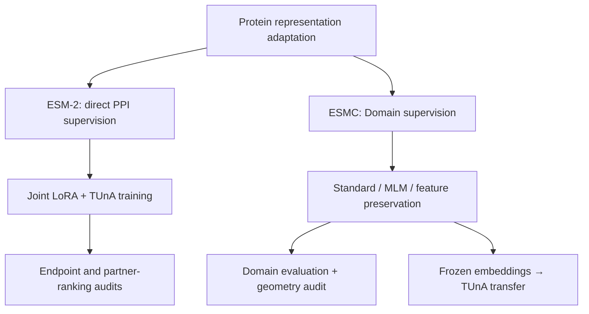

# Experimental design

## Data and separation

| Dataset | Training | Validation | Test | Key constraint |
|---|---:|---:|---:|---|
| Bernett human PPI | Intra1: 129,592 pairs | Intra0: 53,665 pairs | Intra2: 52,048 pairs | Protein-disjoint, similarity-reduced benchmark; train/validation proteins ≤1,500 aa; full test retained |
| Processed InterPro | 809,330 proteins | 49,237 proteins | 49,391 proteins | Whole-protein homology grouping; train ≤1,024 aa, validation/test ≤4,096 aa; 64 Domain classes |

The report describes MMseqs2 clustering at 30% sequence identity and 60% bidirectional coverage for InterPro proteins of at least 30 residues, with connected components assigned to a single partition. Shorter sequences were grouped by exact identity. Domain classes required at least 5,000 training targets and 250 targets in each held-out partition. Preprocessing is described in the report but its implementation and split artifacts are not included.

Intra0 was used for model selection; Intra2 for final PPI evaluation. Retrospective endpoint analyses on Intra2 characterize frozen predictions and must not be reused as a model-selection procedure. The CPU overlap utility checks identifiers only; it cannot verify sequence-similarity separation.

## Two adaptation branches

**PPI-directed adaptation.** The report uses ESM-2 t30 (150M; 640 features per residue) with rank-8 LoRA, α = 16, and a jointly trained TUnA head. Training samples 512-residue windows for longer proteins; evaluation uses complete sequences. Retained configurations and diagnostic scripts are available; the original training entry point is not included.

**Domain specialization.** ESMC-300M supplies 960-dimensional residue representations. Stage 1 localizes Domain residues; Stage 2 identifies Domains from masked regions. The implemented curriculum allocates 15% of optimizer steps to localization only, 20% to a 3:1 localization/identification ratio, and 65% to equal mixing. Deterministic shuffling within ratio blocks makes task choices consistent across distributed ranks. The total step count must be divisible by 40.

**Representation preservation.** A reference pass disables LoRA on the same encoder, without gradient tracking. The loss compares adapted and reference hidden states at post-block layers 6, 12, 18, 24, and 30. Features are normalized along the token dimension; masking excludes padding. Losses are averaged across selected layers and give equal weight per protein. The reported preservation weight is α = 10. See the [implementation](../src/interpro_joint/representation_regularization.py).

## Evaluation

**Domain evaluation:** predicted and annotated spans are matched one-to-one at IoU ≥0.5, with ambiguous overlaps excluded. End-to-end correctness requires both localization and the correct InterPro identity. Oracle identification supplies annotated spans and is an easier, separate measurement.

**PPI transfer:** freeze each ESMC encoder, export residue embeddings, train the same downstream TUnA configuration per condition, select checkpoints on Intra0 accuracy, and evaluate on Intra2. ESM-2 and ESMC baselines are separate experiments.

**Geometry:** compare mean-pooled final-layer representations using 50-nearest-neighbour retention, cosine-similarity correlations on fixed sampled pairs, and linear CKA.

**Region compatibility:** pool Base ESMC features within gold Domain or Family spans; combine cross-protein region vectors symmetrically as `[u+v, |u−v|, u⊙v]`; learn compatibility scores and aggregate with normalized log-sum-exp pooling. Fit late fusion on Intra0 and evaluate unchanged on annotation-eligible Intra2 pairs.

This is a reading guide to the supplied report and retained implementation. Exact launch arguments are in the [Slurm wrappers](../scripts/interpro_training/), with reproduction constraints in [REPRODUCIBILITY.md](../REPRODUCIBILITY.md).
