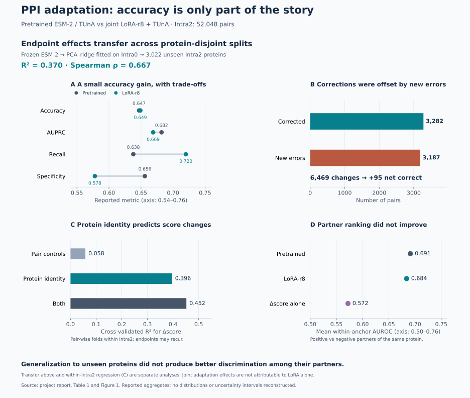

# Results and interpretation

The project asks whether adapting protein representations supplies **partner-specific interaction information**, and whether biologically guided specialization preserves features that transfer to PPI prediction. All values below come from the supplied project report; [provenance and machine-readable tables](../reports/README.md) identify their sources.

## 1. Direct PPI adaptation: a small accuracy gain needs an explanation

The ESM-2/TUnA comparison used the full protein-disjoint Intra2 partition (52,048 pairs).

| Model | Accuracy | MCC | Recall | Specificity | AUPRC |
|---|---:|---:|---:|---:|---:|
| Pretrained TUnA | 0.647 | 0.294 | 0.638 | 0.656 | 0.682 |
| LoRA-r8 | 0.649 | 0.301 | 0.720 | 0.578 | 0.669 |

Among 6,469 class changes, 3,282 corrected a prediction and 3,187 broke one: **95 net additional correct predictions**. The gain came with lower AUPRC and a recall/specificity trade-off. These figures motivate examining *which* pairs changed, rather than interpreting accuracy alone.

The additive endpoint model explained held-out score-change variance of **R² = 0.396**, compared with **0.058** for pair-level baseline-score controls; the combined model reached **0.452**. This diagnostic used pair-wise cross-validation *within* Intra2 so endpoint effects could be estimated on one partner and evaluated on another. It is not a claim of protein-disjoint generalization for that regression. A separate embedding-based transfer analysis on 3,022 unseen Intra2 proteins gave **R² = 0.370** and Spearman **ρ = 0.667**.

### Why the unseen-protein transfer result matters

The embedding-transfer pipeline mean-pooled and L2-normalized frozen pretrained **ESM-2** features, selected PCA/ridge settings within Intra0, then applied the fitted pipeline unchanged to protein-disjoint Intra2. Independently estimated Intra2 endpoint coefficients served only as evaluation targets. The reported **R² = 0.370** and **ρ = 0.667** therefore show that endpoint-associated adaptation effects were predictable from representations of proteins absent from the regression's fitting set.

Embedding-space similarity is a useful intuition for why separating identities need not remove shared predictive structure. However, the reported experiment is **PCA–ridge transfer, not nearest-neighbour prediction**, and it uses **ESM-2, not ESMC**. It does not directly establish that local neighbours share the same effect, or identify which biological features explain the association.

This is useful because generalizing to unseen proteins and learning partner-specific compatibility are distinct achievements. The mean within-anchor AUROC fell from **0.691 to 0.684**, while the adaptation-associated score change alone reached **0.572**. Thus, transferable endpoint effects coexisted with weaker partner ranking in this experiment.

The report's same-anchor analyses did not show improved partner ranking. Protein-disjoint evaluation can therefore still contain transferable protein-level propensities. Endpoint-associated effects are **not themselves proof of train/test identity leakage**. Because the LoRA parameters and TUnA head were jointly optimized, the score changes cannot be attributed to LoRA alone.

Source: Table 1 and Figure 1, pp. 5–6. [Retained analysis scripts](../scripts/lora/)

## 2. Domain specialization: success on the supervised task does not guarantee transfer

Each ESMC representation condition supplied frozen residue embeddings to a separately trained, identically configured TUnA predictor. Checkpoint selection used Intra0 accuracy.

| Representation | Intra2 accuracy | Intra2 AUPRC | Domain end-to-end F1 |
|---|---:|---:|---:|
| Base ESMC | 0.6467 | 0.6954 | — |
| Standard Domain specialization | 0.6063 | 0.6422 | 0.7579 |
| MLM preservation | 0.6122 | 0.6398 | — |
| Representation preservation, α = 10 | 0.6454 | 0.6919 | 0.7340 |

Domain supervision learned the annotations well but reduced PPI transfer. Keeping masked-token prediction close to its original performance was insufficient: cross-entropy recovered from 2.6283 to 1.5452 (base 1.5313), yet PPI AUPRC remained 0.6398.

Direct representation preservation recovered approximately **93.4% of the AUPRC loss** introduced by Standard specialization: `(0.6919 − 0.6422) / (0.6954 − 0.6422)`. This is recovery of a loss, not a 93.4% absolute performance improvement, and the resulting AUPRC remained below the base model.

| Geometry relative to Base ESMC | Standard | MLM-preserved | Representation-preserved |
|---|---:|---:|---:|
| 50-nearest-neighbour preservation | 13.0% | 13.6% | 45.8% |
| Pairwise cosine Spearman ρ | 0.399 | 0.459 | 0.837 |
| Linear CKA | 0.394 | 0.478 | 0.915 |

Preserved geometry accompanied recovered transfer. These experiments support the usefulness of direct representation constraints in this setting; they do not isolate a universal causal mechanism.

Source: Results pp. 7–9 and Figure 2. [Training](../scripts/interpro_training/) · [Geometry audits](../scripts/geometry/)

## 3. Functional regions: modest complementary signal on matched subsets

Gold InterPro regions were pooled from Base ESMC embeddings, compared across partners, and fused with Base TUnA using logistic regression fitted on Intra0.

| Eligible subset | Pairs | Region-only AUPRC | Matched Base AUPRC | Fused AUPRC |
|---|---:|---:|---:|---:|
| Domain | 28,525 (54.8%) | 0.6228 | 0.6745 | 0.6847 |
| Family | 38,321 (73.6%) | 0.6421 | 0.7075 | 0.7119 |

Fusion provided modest gains on each matched subset. **0.7119 is not a full-Intra2 result** and must not be compared directly with the full-set 0.6954 baseline. Annotation availability restricts coverage; these experiments also use the broader Domain/Family annotation collection rather than the 64-class specialization dataset.

Source: Table 2, p. 9. [Compatibility and fusion scripts](../scripts/functional_regions/)

## Limitations and next questions

- The study evaluates selected encoders and TUnA on one human PPI benchmark. Its results do not establish a universal performance ceiling.
- The retained configurations center on seed 47; these summary tables do not establish robustness across training seeds or statistical significance of the small gains.
- Protein-level associations, geometric similarity, and downstream transfer are related measurements, not interchangeable evidence of biological mechanism.
- Gold annotations restrict the functional-region experiments to eligible pairs. Applying the approach to unannotated proteins would require separately evaluated predicted regions.
- Raw predictions, weights, preprocessing code, and exact historical source revisions are incomplete in this release. See the [reproduction boundary](../REPRODUCIBILITY.md).

The next research question is whether **partner-conditioned biological features** can improve interaction ranking while preserving useful pretrained structure. That is a proposed direction, not a capability implemented or demonstrated here. The broader interest is transferable representations of biological systems; cell-state and perturbation modeling would require new data, methods, and evaluation.
